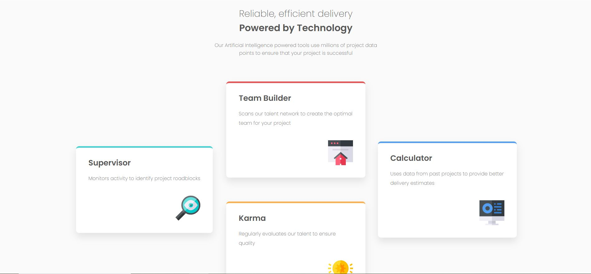

# Frontend Mentor - Four card feature section solution

This is a solution to the [Four card feature section challenge on Frontend Mentor](https://www.frontendmentor.io/challenges/four-card-feature-section-weK1eFYK). Frontend Mentor challenges help you improve your coding skills by building realistic projects.

## Table of contents

- [Overview](#overview)
  - [The challenge](#the-challenge)
  - [Screenshot](#screenshot)
  - [Links](#links)
- [My process](#my-process)
  - [Built with](#built-with)
  - [What I learned](#what-i-learned)
  - [Continued development](#continued-development)
  - [Useful resources](#useful-resources)
- [Author](#author)

## Overview

### The challenge

Users should be able to:

- View the optimal layout for the site depending on their device's screen size

### Screenshot

### Links

- Solution URL: [Github](https://github.com/abigailjulie/FrontendMentor_FourCardSection)
- Live Site URL: [Vercel](https://frontendmentorfourcardsection.vercel.app/)

## My process

### Built with

- Semantic HTML5 markup
- CSS custom properties
- Flexbox
- CSS Grid
- Mobile-first workflow

### What I learned

- I learned that working through the mobile version first was best practice.
- I learned about to use elements of flex and the CSS grid together.

### Continued development

- I am still not completely comfortable with the CSS grid and the shortcuts. I struggled with figuring out how to place the sections and gaps along the centerline approriately.

### Useful resources

- [MDN Grid](https://developer.mozilla.org/en-US/docs/Web/CSS/CSS_grid_layout/Basic_concepts_of_grid_layout) - This MDN page was foundational for my learning.
- [Youtube Grid](https://www.youtube.com/@slayingthedragon) - This youtube channel helped me to understand the fundementals.

## Author

- Website - [Abigail Figaro](https://www.abigaildesigns.org)
- Frontend Mentor - [@abigailjulie](https://www.frontendmentor.io/profile/abigailjulie)
